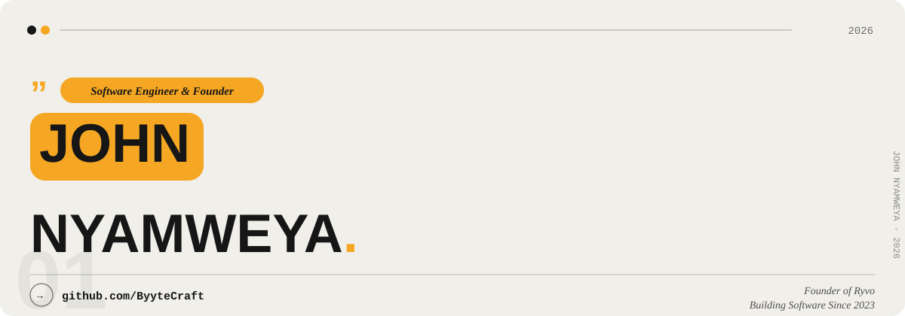
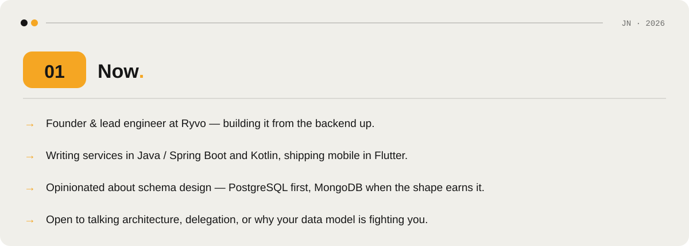
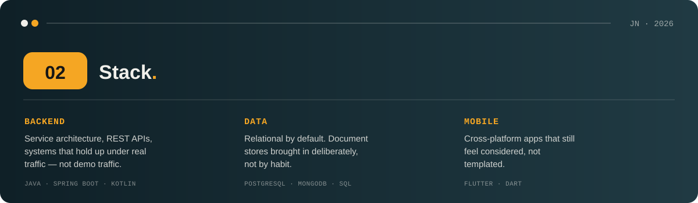
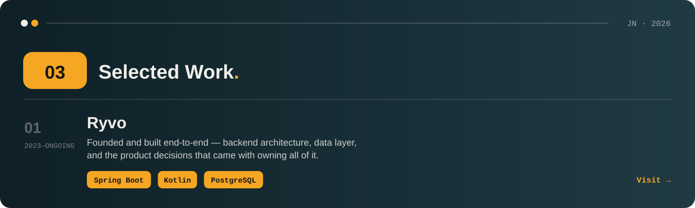
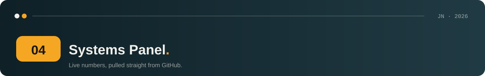
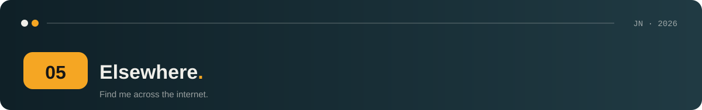

<picture>
  <source media="(prefers-color-scheme: dark)" srcset="readme/banner-dark.svg">
  
</picture>

<picture>
  <source media="(prefers-color-scheme: dark)" srcset="readme/section-01-now-dark.svg">
  
</picture>

<picture>
  <source media="(prefers-color-scheme: dark)" srcset="readme/section-02-stack-dark.svg">
  
</picture>

<a href="https://john.ryvo.co.ke/">
<picture>
  <source media="(prefers-color-scheme: dark)" srcset="readme/section-03-work-dark.svg">
  
</picture>
</a>

<picture>
  <source media="(prefers-color-scheme: dark)" srcset="readme/section-04-header-dark.svg">
  
</picture>

<picture>
  <source media="(prefers-color-scheme: dark)" srcset="https://streak-stats.demolab.com/?user=ByyteCraft&theme=default&background=161616&stroke=F5A623&ring=F5A623&fire=F5A623&currStreakLabel=F0EFEA&sideLabels=F0EFEA&dates=F0EFEA&border=F5A623&border_radius=16">
  
</picture>
 

<picture>
  <source media="(prefers-color-scheme: dark)" srcset="readme/section-05-header-dark.svg">
  
</picture>

  

<picture>
  <source media="(prefers-color-scheme: dark)" srcset="readme/footer-dark.svg">
  
</picture>

